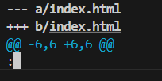

# Git tutorial
ref: [doc พี่ไมค์](https://docs.mikelopster.dev/c/basic/git/intro)

## ติดตั้ง Git Graph
- เป็น extention เอาไว้ดู graph 
- วิธีเปิดใช้
    - `Ctrl + shift + p`
    - เลือก `Git Graph: view Git Graph (git log)`
    - 
    

## Basic Command
| คำสั่ง | คำอธิบาย |
|---|---|
| `git status` | เช็คสถานะของ repository |
| `git log` | ดูประวัติ commit / log |
| `git diff <ชื่อไฟล์>` | ดูการเปลี่ยนแปลงของไฟล์ |

## Branch Command
| คำสั่ง | คำอธิบาย |
|---|---|
| `git branch` | เช็ค branch ที่มีและ branch ปัจจุบัน |
| `git branch -m <ชื่อ branch>` | เปลี่ยนชื่อ branch ปัจจุบัน |
| `git checkout -b <ชื่อ branch>` | สร้าง branch ใหม่และย้ายไปทำงานบน branch นั้น |
| `git checkout <ชื่อ branch>` | ย้ายไปยัง branch ที่ต้องการ |
| `git merge <ชื่อ branch>` | รวม branch นั้นเข้ากับ branch ปัจจุบัน (ถ้าเปิด editor ให้แก้ข้อความ commit แล้วพิมพ์ `:wq` เพื่อออก) |

## Git server and remote command
| คำสั่ง | คำอธิบาย |
|---|---|
| `git clone <url>` | โคลน repository จาก remote ไปยังเครื่องของคุณ |
| `git fetch <remote>` | ดึงข้อมูลจาก remote โดยไม่ merge (ใช้เมื่อต้องการตรวจสอบก่อน) |
| `git fetch --all` | ดึงข้อมูลจากทุก remote ที่ตั้งค่าไว้ |
| `git stash` | เก็บการเปลี่ยนแปลงชั่วคราวเพื่อนำ workspace กลับสู่สถานะสะอาด |
| `git stash pop` | นำการเปลี่ยนแปลงจาก stash กลับมาและลบ stash นั้น |
| `git tag -a <tag> -m "msg"` | สร้าง annotated tag พร้อมข้อความ |
| `git push <remote> --tags` | อัพโหลด tags ขึ้น remote |

## How to pull request
- กด compare

- ดูครงนี้ให้ดี

- Note
    - ตอนทำงานจริงให้ทำแบบนี้แทนการ merge branch ตัวเอง เข้า main มั่วซั่ว
    - pull request เกิดจากการอัพงานจาก branch ตัวเอง ขึ้น github
