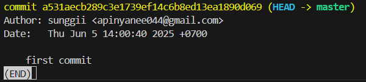
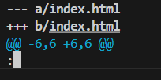
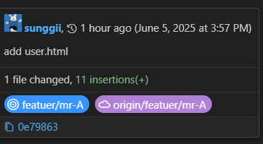

# What I learned
* [doc พี่ไมค์ ](https://docs.mikelopster.dev/c/basic/git/intro)

## Note
* ถ้าเจอหน้าจอ terminal แบบนี้ 



ให้กด ```q ``` ออกมา

---------------------------------------------

* จ้าเจอ terminal แบบนี้ 




กด ``` enter ``` ต่อให้จบ แล้ว ```q ``` ออกมา

---------------------------------------------

* ถ้า merge branch เสร็จแล้ว กด ```Esc``` ก่อน แล้วตามด้วย ```:wq``` เพื่อออก

    แต่อย่าหา merge เข้า main มั่วซั่ว


* วิธีเปลี่ยนชื่อ branch ที่ทำอยู่ ```git branch -m <ชื่อใหม่>```


* ถ้าจะพิมคำสั่งก่อนหน้ากด ```PgUp``` เหมือนตอนเรียน sicco ได้เลย


## Command เพิ่มเติม
* ``` git diff index.html ``` เอาไว้ใช้ดูว่าอัปเดตไรไป

* ```  git log ```  ใช้ทุกครั้งหลัง commit มันจะขึ้นชื่อ/วัน ที่ commit


## สรุป step การใช้ git คร่าวๆ
จากโพยอันเก่า 
```
echo "# field-from" >> README.md //ไม่ต้องเพราะเราไม่มี README
git init
git add README.md // git add . พิมพ์แบบนี้แทน
git commit -m "first commit"
git branch -M main
git remote add origin https://github.com/sunggii/field-from.git //link จะเจนใหม่ตาม repo ของเรา
git push -u origin main
```

### step การใช้ git เวลาจะแก้งานแล้วอัพใหม่
1. update งานทุกครั้งที่ทีการเปลี่ยนแปลง (```git add - git commit```  ทำผ่าน UL)
4. ``` git push ``` ตามโพยเก่า เป็นอันจบโค้ดเราก็จะขึ้น github เรียบร้อย


## เคสที่เอาไปใช้จริงได้
* ```git checkout <commit hash>``` = ย้อนเวลา



0e79863 คือ commit hash ไป coppy มา

**ตัวอย่างการย้อนเวลา**

```PS D:\git> git checkout 0e79863045617c5e6798d077ca9b08d488ce59df```
