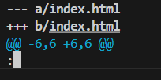
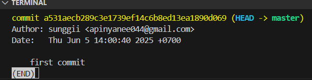

# What I learned
* [doc พี่ไมค์ ](https://docs.mikelopster.dev/c/basic/git/intro)

## Note
* ถ้าเจอหน้าจอ terminal แบบนี้ 


ให้กด ```q ``` ออกมา

* จ้าเจอ terminal แบบนี้ 




กด ``` enter ``` ต่อให้จบ แล้ว ```q ``` ออกมา

* ถ้าจะพิมคำสั่งก่อนหน้ากด ```PgUp``` เหมือนตอนเรียน sicco ได้เลย

## Command เพิ่มเติม
* ``` git diff index.html ``` เอาไว้ใช้ดูว่าอัปเดตไรไป

* ```  git log ```  ใช้ทุกครั้งหลัง commit มันจะขึ้นชื่อ/วัน ที่ commit


